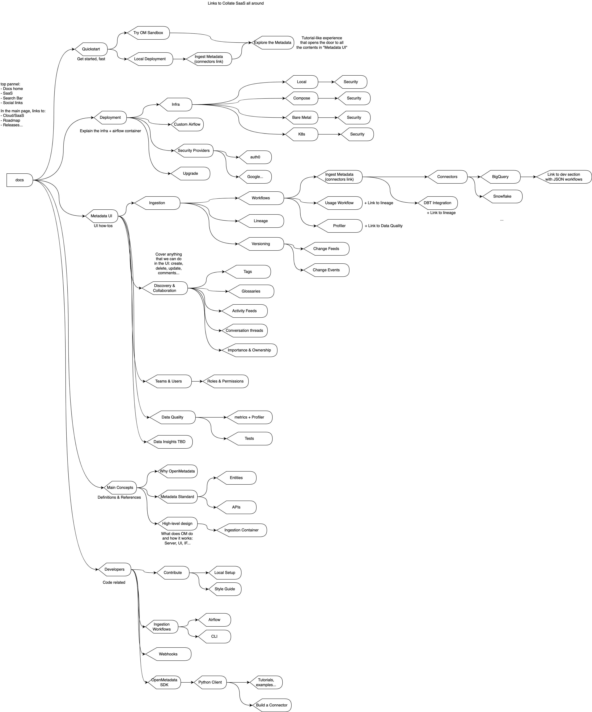

# OpenMetadata Docs

Based on the great work of Streamlit's [documentation framework](https://github.com/streamlit/docs).

## Building

To build the docs, clone this repo, install the NPM dependencies, and start the development server.

You might need to run `brew install node next` before.

1. Clone this repo:

```bash
git clone https://github.com/open-metadata/docs.git
cd docs/
```

2. Install the NPM dependencies

```bash
make
```

3. Start the development server:

```bash
make up
```

The docs will be viewable at [http://localhost:3000](http://localhost:3000). Note that any time you modify the source files in the `content/` folder, you'll need to refresh your browser tab to view the changes. You **do not** need to restart the development server.

## Troubleshoot

If you are having trouble bringing the server up, a couple of things to check:
- `node` version ~16.15
- try `npm install --force` & `npm install --legacy-peer-deps`

## File and folder structure

This repo follows a typical Next.js project structure. To contribute, you'll only edit Markdown files within the `content/` folder.

- `components/` Contains JS and MDX files.
  - `components/content/` Has the templates for building the connector docs. 
- `content/` This is where all the Markdown files live. This is the only folder you'll edit.
- `lib/` Contains JS files.
- `pages/` You'll never have to edit this folder. It contains JSX files that handle the complex index page, mapping of URL slugs, and rendering of Markdown pages in `content/`.
- `public/` Contains all the images and YAML files.
- `scripts/` Contains JS files.
- `styles/` Contains CSS files for styling and layout.

## How to add new docs

This is the docs' organisation:



To add a new page:
1. Add the entry under `site_menu` in `content/menu.md`. Make sure you're following the right structure in the `category` (using names) and `url` (building the path).
2. In the file path, create a markdown file. You can name it either as `index.md`, if it is the presentation of a section, or `something.md` if it is a detailed entry.
3. Each `md` file will have the following header (example from `content/metadata-ui/ingestion/lineage.md`):
    ```
    ---
    title: Entity Lineage
    slug: /metadata-ui/ingestion/lineage
    ---
    ```
   The title will be the Page title, and the `slug` will need to match the `url` specified in the `menu.md`.
4. If you need to add any image, they should be placed under `public/images/`, using the same directory structure as the `md` file. You can then add them with `` with normal markdown.
    The path will start from `images`, e.g., `/images/metadata-ui/ingestion/workflows/metadata/connectors/schedule.png`

## Hot to add a new connector

1. Create a new directory with the service type and connector name under `/content/metadata-ui/ingestion/workflows/metadata/connectors/{service}/{connector}`. Supported services are `database`, `messaging`, `dashboard` and `metadata`.
2. Create an `index.md`, `airflow.md` and `cli.md` files. You can copy the main structure of any other connector.
3. Update the title and slug.
4. Update the connector name and specify if it has usage with `hasUsage="true"` in the components.
5. Add the Connection Options in each markdown file.
6. Add the `ingestion.yaml`, `usage.yaml` (if required) and `profiler.yaml` under `/public/ingestion/connectors/{connector}`.
7. Add screenshots of `add-new-service.png`, `select-service.png` and `service-connection.png` under `/public/images/metadata-ui/ingestion/workflows/metadata/connectors/{connector}`.
